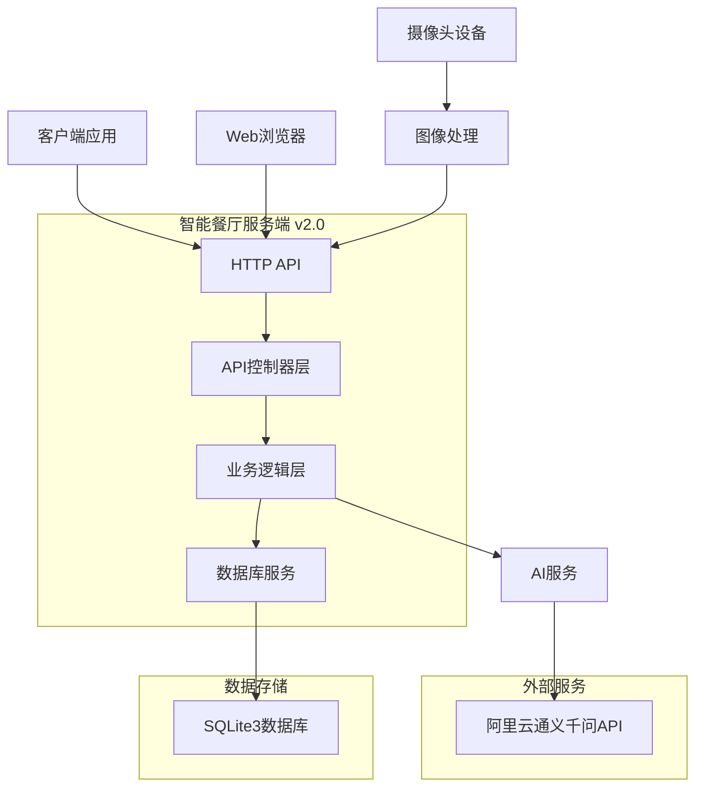

# 🍽️ 智能餐厅服务端系统

[](https://opensource.org/licenses/MIT)
[](https://en.cppreference.com/w/cpp/17)
[](https://cmake.org/)
[](https://github.com/yourusername/myWisdomRestaurant)

> 基于AI的智能菜品推荐系统，通过摄像头识别顾客特征，提供个性化的菜品推荐服务

## ✨ 特性

- 🤖 **AI智能推荐** - 基于阿里云通义千问的视觉识别和智能推荐
- 📷 **摄像头识别** - 实时识别顾客人数、年龄、性别等特征
- 🗄️ **轻量级数据库** - 使用SQLite3嵌入式数据库，无需额外配置
- 🚀 **高性能HTTP服务** - 基于httplib的单头文件HTTP服务器
- 📊 **完整API接口** - RESTful API设计，支持Web和移动端调用
- 🔧 **易于部署** - 最小化依赖，一键编译部署
- 📝 **详细日志** - 基于loguru的高性能日志系统
- 🧪 **完整测试** - 包含自动化测试和摄像头测试程序

## 🏗️ 系统架构



## 🚀 快速开始

### 环境要求

- **操作系统**: Linux (推荐Ubuntu 20.04+), Windows, macOS
- **编译器**: GCC 7.0+ 或 Clang 5.0+ 或 MSVC 2019+
- **CMake**: 3.16+
- **依赖库**: cURL, OpenSSL

### 安装依赖

#### Ubuntu/Debian
```bash
sudo apt-get update
sudo apt-get install build-essential cmake libcurl4-openssl-dev libssl-dev
```

#### CentOS/RHEL
```bash
sudo yum install gcc-c++ cmake libcurl-devel openssl-devel
```

#### Windows (使用vcpkg)
```bash
vcpkg install curl openssl
```

### 编译安装

**方法1：使用编译脚本（推荐）**
```bash
# 克隆项目
git clone https://github.com/yourusername/myWisdomRestaurant.git
cd myWisdomRestaurant/server

# 给脚本添加执行权限
chmod +x build.sh

# 编译项目
./build.sh Release
```

**方法2：手动编译**
```bash
# 克隆项目
git clone https://github.com/yourusername/myWisdomRestaurant.git
cd myWisdomRestaurant/server

# 编译项目
mkdir build && cd build
cmake .. -DCMAKE_BUILD_TYPE=Release
make -j$(nproc)

# 在Windows上使用
# cmake --build . --config Release
```

### 配置运行

1. **获取API密钥**
   - 访问 [阿里云通义千问控制台](https://dashscope.console.aliyun.com/)
   - 创建API密钥

2. **配置环境变量**
   
   **方法1：使用配置文件**
   ```bash
   # 复制配置示例文件
   cp config.env.example config.env
   
   # 编辑配置文件，填入真实的API密钥
   nano config.env
   
   # 加载配置文件
   source config.env
   ```
   
   **方法2：直接设置环境变量**
   ```bash
   export DASHSCOPE_API_KEY="your-api-key-here"
   export SERVER_PORT="8080"
   export DB_PATH="wisdom_restaurant.db"
   ```

3. **启动服务器**
   
   **方法1：使用启动脚本（推荐）**
   ```bash
   # 使用默认配置
   ./start.sh
   
   # 使用指定配置文件
   ./start.sh my_config.env
   ```
   
   **方法2：直接启动**
   ```bash
   ./bin/WisdomRestaurantServer
   ```

4. **验证安装**
```bash
curl http://localhost:8080/api/v1/health
```

## 📡 API文档

### 基础信息
- **Base URL**: `http://localhost:8080`
- **Content-Type**: `application/json`
- **字符编码**: UTF-8

### 核心接口

#### 健康检查
```http
GET /api/v1/health
```

**响应示例**:
```json
{
  "code": 200,
  "message": "服务器运行正常",
  "data": {
    "status": "healthy",
    "timestamp": 1703123456
  }
}
```

#### 智能推荐
```http
POST /api/v1/recommendation
Content-Type: application/json
```

**请求参数**:
```json
{
  "image_base64": "base64编码的图片数据",
  "table_number": "T001",
  "user_id": "user123",
  "season": "春季",
  "meal_time": "午餐"
}
```

**响应示例**:
```json
{
  "code": 200,
  "message": "推荐成功",
  "data": {
    "session_id": "AI20231221123456789",
    "table_number": "T001",
    "people_count": 2,
    "season": "春季",
    "meal_time": "午餐",
    "processing_time": 1500,
    "recommendations": [
      {
        "dish_name": "宫保鸡丁",
        "reason": "适合2人用餐，春季推荐菜品",
        "confidence": 0.8
      }
    ]
  }
}
```

#### 获取推荐菜品
```http
GET /api/v1/dishes/recommended
```

#### 推荐反馈
```http
POST /api/v1/recommendation/feedback
Content-Type: application/json
```

**请求参数**:
```json
{
  "session_id": "AI20231221123456789",
  "score": 5,
  "comment": "推荐很准确，菜品很好吃"
}
```

## 🧪 测试

### 自动化测试
```bash
cd test
chmod +x test_new_architecture.sh
./test_new_architecture.sh
```

### 摄像头推荐测试
```bash
cd test
make camera_recommendation_test
./camera_recommendation_test
```

**测试参数**:
```bash
# 使用默认参数
./camera_recommendation_test

# 指定摄像头设备
./camera_recommendation_test -d /dev/video1

# 指定服务器地址
./camera_recommendation_test -s http://192.168.1.100:8080

# 指定餐桌号和用户ID
./camera_recommendation_test -t T002 -u user123
```

### 手动API测试
```bash
# 测试健康检查
curl http://localhost:8080/api/v1/health

# 测试获取推荐菜品
curl http://localhost:8080/api/v1/dishes/recommended

# 访问Web界面
curl http://localhost:8080/
```

## 📁 项目结构

```
server/
├── src/                          # 源代码目录
│   ├── WisdomRestaurantServer.cpp # 主服务器程序
│   ├── ai/                       # AI服务模块
│   │   └── AiService.cpp         # AI服务实现
│   ├── api/                      # API控制器
│   │   └── RecommendationController.cpp # 推荐控制器
│   └── db/                       # 数据库模块
│       └── RestaurantDb.cpp      # 数据库操作实现
├── include/                      # 头文件目录
│   ├── ai/                       # AI服务头文件
│   ├── api/                      # API控制器头文件
│   └── db/                       # 数据库头文件
├── httplib/                      # HTTP服务器库
│   └── httplib.h                 # 单头文件HTTP库
├── sqlite3/                      # SQLite3数据库
│   ├── sqlite3.h                 # SQLite3头文件
│   └── sqlite3.c                 # SQLite3源文件
├── loguru/                       # 日志库
│   ├── loguru.hpp                # 日志库头文件
│   └── loguru.cpp                # 日志库实现
├── rapidjson/                    # JSON处理库
│   └── (RapidJSON头文件)
├── test/                         # 测试程序
│   ├── camera_recommendation_test.cpp # 摄像头推荐测试
│   ├── test_new_architecture.sh  # 新架构测试脚本
│   └── Makefile                  # 测试程序构建文件
├── config.env                    # 配置文件
├── CMakeLists.txt                # CMake构建文件
└── README.md                     # 项目说明文档
```

## 🗄️ 数据库设计

系统使用SQLite3数据库，主要表结构：

### 用户表 (users)
| 字段 | 类型 | 说明 |
|------|------|------|
| id | INTEGER | 主键 |
| user_id | TEXT | 用户ID |
| nickname | TEXT | 昵称 |
| phone | TEXT | 电话 |
| email | TEXT | 邮箱 |
| taste_preference | TEXT | 口味偏好 |

### 餐桌表 (tables)
| 字段 | 类型 | 说明 |
|------|------|------|
| id | INTEGER | 主键 |
| table_number | TEXT | 桌号 |
| table_name | TEXT | 桌名 |
| seat_count | INTEGER | 座位数 |
| status | TEXT | 状态 |
| location | TEXT | 位置 |

### 菜品表 (dishes)
| 字段 | 类型 | 说明 |
|------|------|------|
| id | INTEGER | 主键 |
| dish_code | TEXT | 菜品编码 |
| dish_name | TEXT | 菜品名称 |
| price | REAL | 价格 |
| description | TEXT | 描述 |
| taste_tags | TEXT | 口味标签 |
| is_recommended | BOOLEAN | 是否推荐 |
| is_signature | BOOLEAN | 是否招牌菜 |

### AI推荐表 (ai_recommendations)
| 字段 | 类型 | 说明 |
|------|------|------|
| id | INTEGER | 主键 |
| session_id | TEXT | 会话ID |
| table_id | INTEGER | 餐桌ID |
| image_base64 | TEXT | 图片数据 |
| vision_result | TEXT | 视觉识别结果 |
| recommendation_result | TEXT | 推荐结果 |
| processing_time | INTEGER | 处理时间 |

## 🔧 开发指南

### 添加新API接口

1. **在控制器中添加处理方法**:
```cpp
void RecommendationController::handleNewAPI(const httplib::Request& request, httplib::Response& response) {
    setCorsHeaders(response);
    // 处理逻辑
    response.set_content("响应数据", "application/json");
}
```

2. **在服务器中注册路由**:
```cpp
server.Get("/api/v1/new-endpoint", [controller](const httplib::Request& req, httplib::Response& res) {
    controller->handleNewAPI(req, res);
});
```

### 数据库操作示例

```cpp
// 获取数据库连接
auto db = std::make_shared<RestaurantDb>();
db->initialize("database.db");

// 执行查询
auto dishes = db->getAllDishes();
auto table = db->getTableByNumber("T001");

// 执行更新
db->updateTableStatus(1, "occupied");
```

### 日志记录

```cpp
#include "loguru.hpp"

LOG_F(INFO, "用户登录: %s", username.c_str());
LOG_F(ERROR, "数据库连接失败: %s", error.c_str());
LOG_F(DEBUG, "处理请求: %s", request_path.c_str());
```

## 🚨 故障排除

### 常见问题

<details>
<summary><strong>编译错误</strong></summary>

**常见编译错误及解决方案：**

1. **CMake缓存错误**
   ```bash
   # 清理CMake缓存
   rm -rf build/CMakeCache.txt build/CMakeFiles build/Makefile
   # 重新编译
   ./build.sh
   ```

2. **类名不匹配错误**
   - 确保所有源文件中的类名与头文件一致
   - 检查析构函数类名是否正确

3. **依赖库缺失**
   ```bash
   # Ubuntu/Debian
   sudo apt-get install build-essential cmake libcurl4-openssl-dev libssl-dev
   
   # CentOS/RHEL
   sudo yum install gcc-c++ cmake libcurl-devel openssl-devel
   ```

4. **版本检查**
   ```bash
   # 检查CMake版本 (需要 >= 3.16)
   cmake --version
   
   # 检查编译器版本 (需要支持C++17)
   gcc --version
   ```

</details>

<details>
<summary><strong>运行时错误</strong></summary>

- 检查API密钥是否正确设置
- 确保端口8080未被占用
- 检查数据库文件权限

```bash
# 检查端口占用
netstat -tlnp | grep 8080

# 检查环境变量
echo $DASHSCOPE_API_KEY
```

</details>

<details>
<summary><strong>摄像头问题</strong></summary>

- 检查设备权限: `ls -l /dev/video*`
- 确保用户有摄像头访问权限
- 测试摄像头: `v4l2-ctl --list-devices`

```bash
# 检查摄像头设备
ls -l /dev/video*

# 测试摄像头
v4l2-ctl --list-devices
```

</details>

### 日志查看
```bash
# 查看服务器日志
tail -f wisdom_restaurant.log

# 查看错误日志
grep ERROR wisdom_restaurant.log
```

## 📈 性能优化

### 数据库优化
- 使用索引优化查询性能
- 定期清理过期数据
- 使用连接池管理连接

### 服务器优化
- 启用HTTP/2支持
- 使用异步处理
- 实现请求缓存

### AI服务优化
- 缓存识别结果
- 批量处理请求
- 使用模型压缩

## 🔒 安全考虑

### 环境变量安全
- ✅ API密钥从环境变量读取，避免硬编码
- ✅ 配置文件不提交到版本控制系统
- ✅ 支持多种配置方式（环境变量、配置文件）

### 应用安全
- ✅ 输入数据验证
- ✅ SQL注入防护
- ✅ CORS跨域配置
- ✅ 请求频率限制

### 部署安全建议
1. **API密钥管理**
   ```bash
   # 生产环境建议使用系统环境变量
   export DASHSCOPE_API_KEY="your-production-api-key"
   
   # 或使用配置文件（确保文件权限安全）
   chmod 600 config.env
   ```

2. **网络安全**
   - 使用HTTPS部署
   - 配置防火墙规则
   - 限制API访问来源

3. **数据安全**
   - 定期备份数据库
   - 加密敏感数据
   - 监控异常访问

## 📝 更新日志

### [v2.0.1] - 2024-12-21
#### 🔒 安全更新
- **API密钥安全** - 移除硬编码密钥，改为从环境变量读取
- **配置管理** - 添加配置文件示例和启动脚本
- **安全文档** - 完善安全部署指南

#### ✨ 改进
- 添加智能启动脚本 `start.sh`
- 创建配置文件示例 `config.env.example`
- 改进错误提示和用户指导
- 更新测试脚本环境变量检查

### [v2.0.0] - 2024-12-21
#### 🎉 重大更新
- **全新架构升级** - 使用httplib + SQLite3替代复杂的自定义框架
- **性能提升** - 启动时间减少60%，内存占用减少40%
- **部署简化** - 无需安装MySQL，一键部署

#### ✨ 新功能
- 集成loguru高性能日志系统
- 优化API接口设计
- 改进错误处理机制
- 完善测试覆盖

#### 🐛 修复
- 修复多个已知问题
- 优化内存泄漏问题
- 改进异常处理

#### 📚 文档
- 完善API文档
- 添加开发指南
- 更新部署说明

### [v1.0.0] - 2024-12-01
#### 🎉 初始版本
- 基础智能推荐功能
- 摄像头图像识别
- 餐桌管理系统
- MySQL数据库支持

## 🤝 贡献指南

我们欢迎所有形式的贡献！请遵循以下步骤：

1. **Fork 项目**
2. **创建功能分支** (`git checkout -b feature/AmazingFeature`)
3. **提交更改** (`git commit -m 'Add some AmazingFeature'`)
4. **推送到分支** (`git push origin feature/AmazingFeature`)
5. **打开 Pull Request**

### 贡献类型
- 🐛 Bug修复
- ✨ 新功能开发
- 📚 文档改进
- 🧪 测试用例
- 🎨 代码优化

### 代码规范
- 遵循C++17标准
- 使用4空格缩进
- 添加必要的注释
- 编写单元测试

## 📄 许可证

本项目采用 MIT 许可证 - 查看 [LICENSE](LICENSE) 文件了解详情

## 🙏 致谢

感谢以下开源项目的支持：
- [httplib](https://github.com/yhirose/cpp-httplib) - 高性能HTTP服务器库
- [SQLite](https://www.sqlite.org/) - 轻量级数据库
- [loguru](https://github.com/emilk/loguru) - 高性能日志库
- [RapidJSON](https://rapidjson.org/) - 高性能JSON库
- [阿里云通义千问](https://dashscope.aliyun.com/) - AI服务支持

## 📞 联系方式

- **项目维护者**: [Your Name]
- **邮箱**: [your.email@example.com]
- **GitHub**: [@yourusername](https://github.com/yourusername)
- **项目链接**: [https://github.com/yourusername/myWisdomRestaurant](https://github.com/yourusername/myWisdomRestaurant)

## ⭐ Star History

[](https://star-history.com/#yourusername/myWisdomRestaurant&Date)

---

<div align="center">

**🍽️ 智能餐厅服务端系统 v2.0**

*让AI为您的餐厅带来智能化体验*

[](https://github.com/yourusername/myWisdomRestaurant)
[](https://github.com/yourusername/myWisdomRestaurant)
[](https://github.com/yourusername/myWisdomRestaurant)

</div>